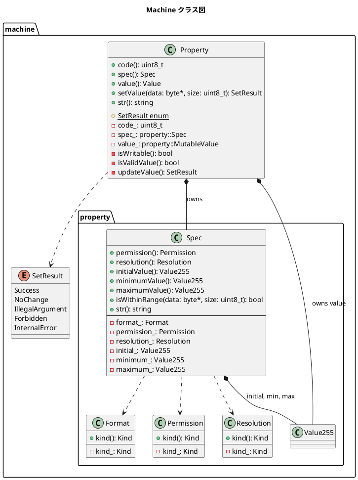

# Markdown

## machine



解説

```text
以下の要素を含めています：

Property: 主要クラス、code/spec/valueを保持
SetResult: プロパティ値設定時の戻り値
Spec: プロパティ仕様（Format, Permission, Resolution, Value255）
Format, Permission, Resolution: Spec構成要素
関連は以下のように表現しています：

*--: 構成（PropertyはSpecとMutableValueを完全に所有）
o--: 集約（SpecはFormat/Permission/Resolutionを参照）
..>: 弱依存（PropertyはSetResultを戻り値で返す。でもメンバーではなく一時的）
```
