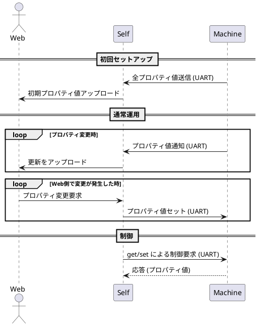
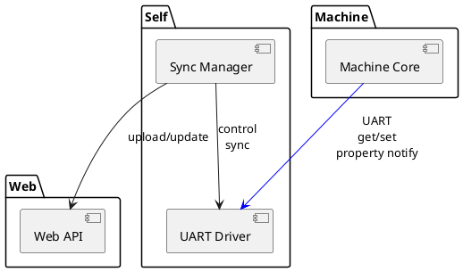

# UART protcol

- 可変長のバイトデータを送受信できる
- フレームとメッセージを分割し、役割分担する。フレームはデータの宛先や整合性、サイズ管理に特化。
- フレームサイズは255が一般的な模様
- 1Mbpsを目標に。さっとやってさっと終わる
- DMAをフル活用する。
- リングバッファは必要そう。
- 分割フレーム。MSG 200 bytes * 255フレームだと、、50,000 KiBか。でもフレーム番号は連番であればよく、すべての値が必要でもない。直近がわかればいいので最悪一周してもいい。

## Frame

STX
1byte: Length 0x01..0xFF
1byte: CMD 0x01 Bulk send, 0x02 one frame, 0x03 ack
1byte: Sequence No 0x00..0xFF, 0x00..
Nbyte: Payload 0..251 bytes
1byte: CRC8 0xCC 1 bytes
ETX

Length分が来なければ、タイムアウトして捨てる。
URAT のような「STX→Length→…→ETX」型フレーミングでは、タイムアウト値は“リンク速度 × 最大フレーム長 × 実装の安全マージン”で決めるのが一番合理的です。
1. UART の実効速度から 1byte の送信時間を求める
UART は 1byte = 10bit（Start + 8bit + Stop）で計算するのが一般的。
例：
- 115200bps → 1byte ≈ 87µs
- 57600bps → 1byte ≈ 174µs
- 9600bps → 1byte ≈ 1.04ms

UART は OS や割り込み遅延、バッファリングで揺れるため、
最低でも 2〜3倍、堅牢にするなら 5倍 が実用的。

115200bps の場合（一般的な高速 UART）
- 最低：50ms
- 安全：100ms
- かなり堅牢：150ms
→ 100ms が最もバランス良い

推奨値（115200bps）
- インターバイトタイムアウト：10〜20ms
- フレーム全体タイムアウト：100ms

ESP32‑C6 だと UART＋DMA の挙動がかなり “素直” なので、ここを前提に最適なタイムアウトをもう一段具体的に落とし込みます。結論から言うと 提示していたタイムアウト値はそのまま妥当で、むしろ ESP32‑C6 では IDLE 検出が強力なのでインターバイトタイムアウトは不要になるケースが多いです。

🔍 ESP32‑C6 の UART DMA 事情（重要ポイントだけ）

✔ UART IDLE 検出がハードウェアで可能

ESP32 系は UART の RX idle interrupt を持っていて、「一定期間 RX line が変化しない＝受信が途切れた」をハードが検出してくれます。

UART_IDLE_INT が発生

DMA の rx_eof とは別に「受信停止」を検知

これを使うと インターバイトタイムアウトをソフトで持つ必要がほぼ無い

✔ DMA はリングバッファ運用が基本

ESP-IDF の UART DMA は：

リングバッファに延々と DMA で書き込む

IDLE 割り込み or タイマで「ここまで受信した」と判断

uart_get_buffered_data_len() で未処理バイト数を取得

この構成だと フレーム全体のタイムアウトだけあれば十分。

📌 ESP32‑C6 前提での最適タイムアウト

■ フレーム全体タイムアウト

115200bps / 最大257byte の場合：

計算上：22ms

安全マージン込み：100ms

ESP-IDF のタスクスケジューラ遅延を考慮しても十分余裕

→ 100ms はそのまま妥当

■ インターバイトタイムアウト

● IDLE 割り込みを使う場合

不要（ハードが「受信途絶」を検出してくれるため）

● IDLE を使わず DMA のみでポーリングする場合

10〜20ms の “新規データなし時間” をインターバイトタイムアウトとして使うのは依然として妥当。

🎯 ESP32‑C6 での最適構成（おすすめ）

りるさんの設計思想（責任範囲の明確化・曖昧さ排除）に合わせて、最も透明性が高く、実装負荷が低い構成をまとめるとこうなります。

✔ 1. UART DMA（リングバッファ）

DMA バッファは 512〜1024byte 程度

uart_driver_install() で RX バッファを DMA に割り当て

✔ 2. UART IDLE 割り込みを有効化

UART_IDLE_INT を有効にする

IDLE 発生時に DMA の現在位置を読み取り、そこまでを「受信完了」と扱う

✔ 3. タイムアウトは「フレーム全体」だけ

STX を見つけたら 100ms タイマ開始

Length 分揃う前に

IDLE が来た

100ms 経過→ どちらでもフレーム破棄

🧩 まとめ

項目

ESP32‑C6 での推奨

フレーム全体タイムアウト

100ms（115200bps）

インターバイトタイムアウト

IDLE 割り込みを使うなら不要

DMA 運用

リングバッファ＋IDLE が最適

途中途絶の検出

IDLE 割り込みで確実に検出

必要なら、

ESP-IDF の具体的な UART 設定コード

IDLE 割り込みのハンドラ例

DMA リングバッファからのフレーム切り出しロジック

URAT の状態遷移図（ASCIIアートで）なども作れるよ。

## 再開ハンドシェイク

コマンド一覧（最小構成）
|  |  |  |
| RX_ABORT |  |  |
| TX_RESET |  |  |
| SYNC_REQ |  |  |
| SYNC_ACK |  |  |
| SOF |  |  |

受信側が異常検出
      ↓
受信側 → 送信側 : RX_ABORT
      ↓
送信側は送信状態を破棄し、TX_RESET を返す
      ↓
受信側は TX_RESET を受信したら SYNC_REQ を送る
      ↓
送信側は SYNC_ACK を返す
      ↓
送信側は SOF（新規フレーム）を送信開始
      ↓
受信側は SOF を受信したら通常受信へ復帰

## Payload

248byte

Prop id 4 bytes
Attr no 1 x 5 byte
Attr len 5 bytes
あと234

受信タイムアウトの可能性

PGでカバーするところ

- 自身のDMAが機能しない（機能しないならほかの方法を考える
- 自身の割り込みロスト（機能しないならほかの方法を考える
- 自身の処理遅延（機能しないならほかの方法を考える
- 自身のバッファオーバーフロー（処理遅延の結果だ。通信設計ミスの線もあり

仕組みで回避するところ

- 相手が死んだ（普通にありえるので復活に備えましょう
- 線が切れた（普通にありえるので復活に備えましょう
- 相手の送信遅延（再ネゴシエーションで防ぐ
- 線が死にかけなど、通信ロスト/化け（再ネゴシエーションで防ぐ

大事なことは、いったん死んでも、確実に復帰できるようにすることや。
