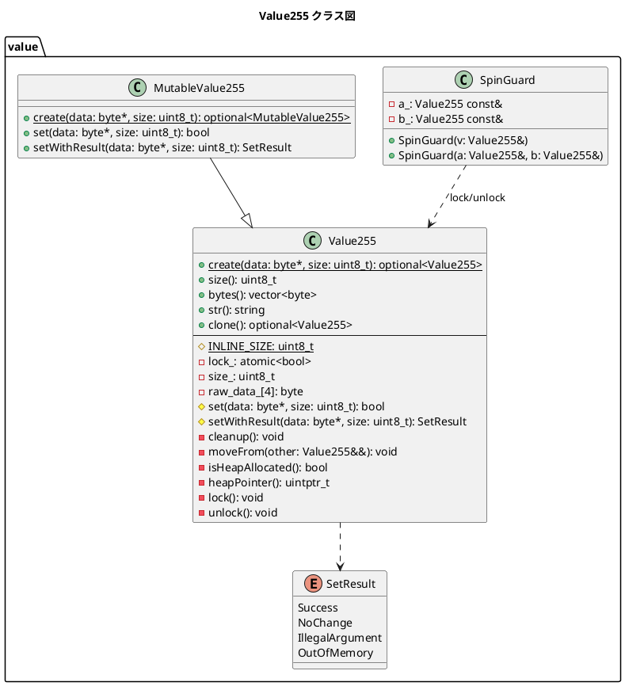
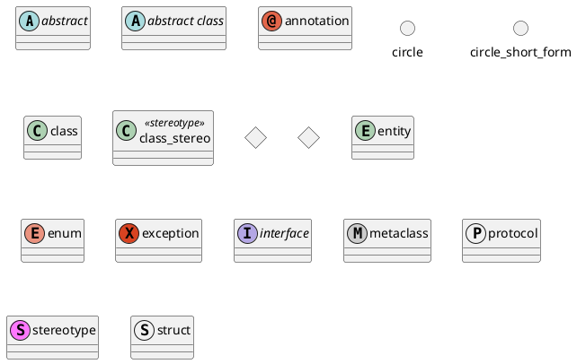

# Markdown

## Value255

## Examples

## Connectors

| **タイプ** | **記号**  | **目的**                                 |
| ---------- | -------- | ---------------------------------------- |
| 拡張       | `<\|--`  | 階層内のクラスの特殊化             |
| 実装       | `<\|..`  | クラスによるインターフェースの実現 |
| 構成       | `*--`    | 全体なくして部分は存在しない             |
| 集約       | `o--`    | 部分は全体から独立して存在できる         |
| 依存性     | `-->`    | オブジェクトが別のオブジェクトを使用する |
| 従属性     | `..>`    | より弱い形の依存関係                     |